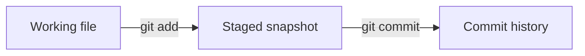

# Local version control

This practical builds a small repository called `aichemy-notes`.

## 1. Create the repository

```console
mkdir aichemy-notes
cd aichemy-notes
git init -b main
git status
```

Git stores repository history and configuration inside the hidden `.git/` directory. Do not edit files inside `.git/` during the workshop.

Expected state:

```text
On branch main
No commits yet
```

Before your first commit, configure your name and email as shown in [Before you begin](00-before-you-begin.md).

## 2. Create the first file

Create `index.md` in your editor:

```markdown
# AIChemy research notes
Topic: reproducible analysis.
```

Save the file, then run:

```console
git status
```

Relevant output (Git may include extra hints):

```text
Untracked files:
  index.md
```

`index.md` is untracked. Git can see the file but has not been asked to include it in a commit.

## 3. Stage the file

```console
git add index.md
git status
```

Relevant output after `git add`:

```text
Changes to be committed:
  new file:   index.md
```

The staging area contains the snapshot that the next commit will record.



## 4. Make the first commit

```console
git commit -m "Introduce the research notes"
git status
```

Example output; your commit hash will differ:

```text
[main (root-commit) 4235002] Introduce the research notes
 1 file changed, 2 insertions(+)
 create mode 100644 index.md
```

The following `git status` reports:

```text
On branch main
nothing to commit, working tree clean
```

A useful commit message completes this sentence: "If applied, this commit will..."

## Practice 1: separate changes

Add this section to `index.md`:

```markdown
## Data
Record the dataset version.
```

Save, stage and commit it:

```console
git add index.md
git commit -m "Record the dataset version"
```

Now add:

```markdown
## Method
Record the analysis settings.
```

Make a second commit:

```console
git add index.md
git commit -m "Record the analysis settings"
git log --oneline
```

Checkpoint: the history contains three commits, each with one clear purpose. Press `q` if Git opened the log in a pager.

## What is a commit hash?

Example `git log --oneline` output, newest first:

```text
3480b70 Record the analysis settings
966495d Record the dataset version
4235002 Introduce the research notes
```

The letters and numbers are short prefixes of commit identifiers. A commit hash is calculated from its recorded content, including the snapshot reference, parent references and metadata such as the author, date and message. Your identifiers will differ from these examples. Use a sufficiently long, unambiguous prefix from your own log wherever an exercise says `HASH`.

## Working tree, staging area and history

These three states explain most everyday Git commands:

| State | Contains | Useful command |
| --- | --- | --- |
| working tree | files currently saved on disk | `git diff` |
| staging area | content selected for the next commit | `git diff --staged` |
| commit history | recorded snapshots | `git log`, `git show` |
