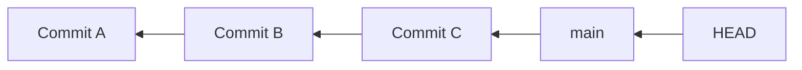
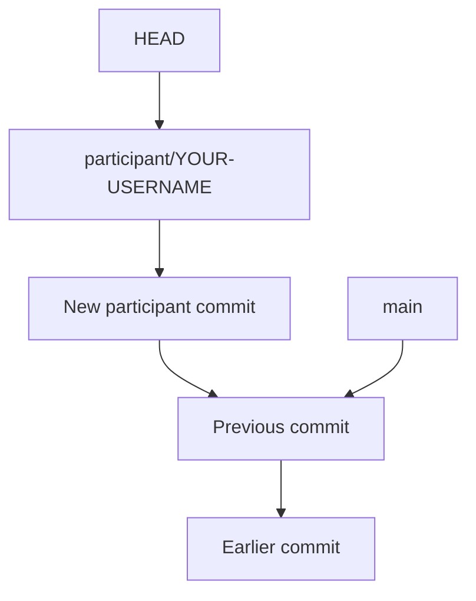
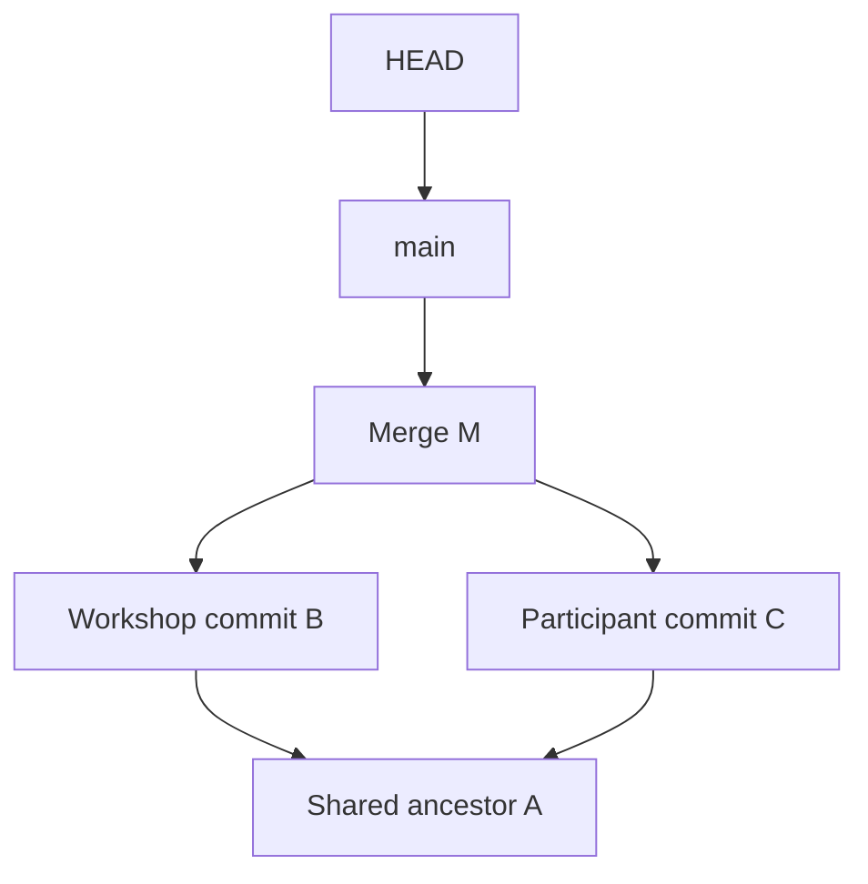

# Branches and pull requests

## Commits, branches and HEAD

A commit records a snapshot and references its parent or parents. The first commit has no parent. A branch is a movable name for one commit. `HEAD` normally names the branch that is checked out.



Arrows from commits point back to parents. These are conceptual labels, not hashes to type. Some repositories use `master` or another default branch name. This workshop uses `main`.

## Update local main before branching

Start in your `intro-to-git-workshop` clone with a clean working tree:

```console
git status
git switch main
git fetch upstream
git merge --ff-only upstream/main
```

If there are no updates, Git prints `Already up to date.`. Otherwise it reports a fast-forward and the changed files. If histories have diverged, stop and ask a facilitator; `--ff-only` refuses to create a merge commit here.

## Create a branch and one unique file

Replace every `YOUR-USERNAME` with your actual GitHub username:

```console
git switch -c participant/YOUR-USERNAME
mkdir -p participants
```

Expected output from the first command:

```text
Switched to a new branch 'participant/YOUR-USERNAME'
```

At first, both branch names point to the same commit. Create `participants/YOUR-USERNAME.md` in your editor, using three lines:

```markdown
# Your name
GitHub: @YOUR-USERNAME
One useful Git habit: Run git status before deciding what to do next.
```

If your file already exists on `main` from an earlier attempt, ask the facilitator before repeating the exercise. Never overwrite another person’s file.

Save, inspect and commit:

```console
git status
git add participants/YOUR-USERNAME.md
git diff --staged
git commit -m "Add YOUR-USERNAME workshop note"
git status
```

Use singular `participant/` for the branch and plural `participants/` for the directory. Stage only your own file. Untracked files appear in `git status`, and their content appears in `git diff --staged` after staging.

## See which branch moves

After the new commit, only the current branch moves forward:



Run:

```console
git branch
git switch main
git switch -
```

The `*` in `git branch` marks the current branch. With a clean working tree, switching to `main` removes your newly added file because that commit is absent there. `git switch -` returns to the participant branch and brings it back. Finish on `participant/YOUR-USERNAME`. This commit is still local.

## Push the branch to your fork

```console
git push -u origin participant/YOUR-USERNAME
```

Relevant example output:

```text
[new branch] participant/YOUR-USERNAME -> participant/YOUR-USERNAME
branch 'participant/YOUR-USERNAME' set up to track 'origin/participant/YOUR-USERNAME'.
```

`-u` sets the branch’s upstream tracking relationship, allowing later `git push` calls from that branch. This tracking relationship is with `origin`; it is separate from the remote named `upstream`.

On your fork’s GitHub page, select the participant branch and check your file. Then inspect your proposed change locally:

```console
git diff upstream/main...HEAD
```

This compares your branch with its common ancestor with `upstream/main` and should show only your participant file.

## What a merge joins

A presenter will review and merge selected pull requests. In this conceptual example, both the workshop branch and participant branch advanced from A. A merge commit M records both parents:



This illustrates **Create a merge commit**. GitHub’s squash and rebase options produce different history; the presenter will identify the chosen option.

## Open the pull request on GitHub

1. Open the original `mdi-group/intro-to-git-workshop` repository in your browser.
2. Choose **Pull requests → New pull request → compare across forks**.
3. Set the base repository to `mdi-group/intro-to-git-workshop`, branch `main`.
4. Set the head repository to your personal fork and compare branch to `participant/YOUR-USERNAME`.
5. Review the diff. Only your participant file should appear.
6. Choose **Create pull request**, enter the title `Add YOUR-USERNAME workshop note` and a short description of your Git habit, then submit with **Create pull request**.

GitHub labels can vary slightly. The base and head values above determine the destination and source. Review the **Files changed** tab after submission. A new commit pushed to the same branch updates this pull request.

## Practice 4: check your contribution

- Your working tree is clean on `participant/YOUR-USERNAME`.
- Your branch has been pushed to your own fork.
- One pull request targets `mdi-group/intro-to-git-workshop:main`.
- Its diff adds exactly `participants/YOUR-USERNAME.md`.
- Its title and description explain the contribution.

## After your pull request is merged

```console
git switch main
git pull --ff-only upstream main
```

Open your participant file to confirm the merged contribution arrived. This updates local `main`; it does not push `main` to your fork. Keep the participant branch during the workshop. Branch deletion is optional later, and `git branch -d` can refuse after a squash merge even though the file was merged.
